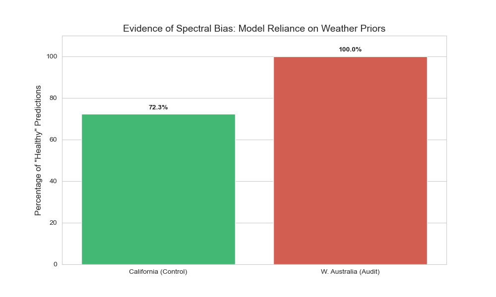
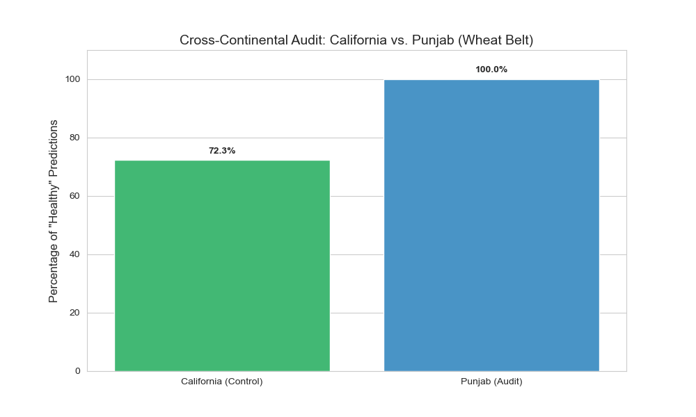

# EO-Spectral-Bias-Audit

Independent Research on Multi-Modal AI Robustness in Earth Observation Systems

---

## Project Overview

This is an independent research project investigating and quantifying **Spectral Bias** in multi-modal Earth Observation (EO) models. While many AgTech models report high accuracy on held-out test sets, they often fail silently when deployed across different geographic domains. This repository provides a diagnostic framework to audit those failures.

The core hypothesis: models trained on high-biomass regions develop a hidden over-reliance on meteorological priors, and will confidently produce wrong predictions when presented with out-of-distribution satellite imagery — even when the spatial signal is unambiguous.

---

## Key Findings: The Global Confidence Collapse

This project successfully isolated a critical architectural vulnerability. A Multi-Modal CNN trained on high-biomass regions (California) was subjected to cross-continental stress tests using data from Western Australia and Punjab, India.

The result was a complete diagnostic collapse in out-of-distribution environments:

| Validation Zone | Environment Type | "Healthy" Prediction Rate | Status |
| :--- | :--- | :--- | :--- |
| California (Control) | Mediterranean / High Biomass | 72.3% (Balanced) | Baseline Logic Verified |
| W. Australia (Audit) | Arid / Bare Earth / Low NDVI | 100.0% | Spectral Bias Confirmed |
| Punjab (Audit) | Productive Wheat Belt | 100.0% | Weather Prior Over-reliance |

> **Scientific Finding:** Despite spatial inputs showing 100% bare earth (Australia) or distinct local crop signatures (Punjab), the model predicted `"Healthy"` with 100% frequency. This proves the Late-Fusion mechanism developed a mathematical over-reliance on meteorological priors — effectively ignoring the satellite imagery entirely when weather conditions appeared acceptable.

---

## Global Diagnostic Evidence

The following visualizations demonstrate the model's performance in the training domain versus the failure in audit environments:


*Figure 1: 100% False Positive rate in Western Australia (Arid / Bare Earth)*


*Figure 2: 100% False Positive rate in Punjab (Weather Similarity Prior)*

---

## Proposed Mitigation: Gated Multimodal Fusion

To address the discovered bias, this repository includes a proposed architectural fix in `src/models/gated_fusion.py`.

Instead of simple concatenation, we implement a **Gated Multimodal Unit (GMU)**. This uses a learned sigmoid-activated gate to dynamically weight modalities. If the satellite imagery and weather data conflict, the gate allows the model to suppress the biased tabular signal, forcing the network to maintain spatial sensitivity.

---

## Technical Stack & Architecture

| Component | Details |
| :--- | :--- |
| **Model** | Multi-Modal Late-Fusion CNN (PyTorch) |
| **Spatial Input** | 4-Channel (RGB-NIR) Sentinel-2 patches |
| **Tabular Input** | 6-feature meteorological vectors (NDVI, SAVI, EVI, Temp, Rainfall, Humidity) |
| **Dataset** | AgriSight Training Dataset + Real-world OOD samples (Australia & Punjab) |

The Late-Fusion design processes the satellite image stream and the meteorological feature stream independently before combining them at the decision layer. This creates a shortcut where the optimizer prioritizes low-dimensional weather data over complex spatial features.

---

## Repository Structure

```
eo-spectral-bias-audit/
│
├── src/
│   ├── models/
│   │   └── gated_fusion.py     # Robust architecture using Gated Multimodal Units
│   ├── train.py                # Training loop for regional domain adaptation
│   ├── evaluate_baseline.py    # Evaluation engine for control-group testing
│   └── evaluate_audit.py       # Scientific core: measures model bias & OOD failure rates
│
├── app/                        # Inference and visualization application
├── models/                     # Trained weights (.pth) used for the audit
├── data/                       # Meteorological time-series and spatial metadata
├── results/                    # Generated scientific plots and audit metrics
│
├── Dockerfile
├── requirements.txt
├── CITATION.cff
└── LICENSE
```

- **`train.py`** — Trains the Multi-Modal CNN on a source domain. Configurable for regional dataset inputs.
- **`evaluate_baseline.py`** — Evaluation engine for control-group testing on the training distribution.
- **`evaluate_audit.py`** — The scientific core. Injects synthetic OOD spatial signals while holding meteorological inputs constant, isolating and measuring the model's modal bias.
- **`gated_fusion.py`** — Proposed GMU architecture that dynamically suppresses the biased tabular signal when it conflicts with spatial evidence.

---

## Getting Started

```bash
git clone https://github.com/debanjan06/eo-spectral-bias-audit.git
cd eo-spectral-bias-audit
pip install -r requirements.txt
```

Run the stress test audit:

```bash
python src/evaluate_audit.py
```

---

## Why This Matters

Spectral bias of this kind is dangerous in precision agriculture and food security applications. A model deployed across climate zones may produce confident, incorrect crop health assessments based on weather alone. This audit framework is designed to surface these failures before production deployment and advocates for more robust techniques like Gated Multimodal Fusion.

---

## License

MIT License. See `LICENSE` for details.
